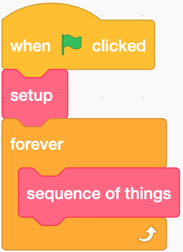

Often, where the computer is reacting live to changes in an environment, we use an **event loop** to organise our code. In these cases, there is some inital setup, and then we have a sequence of things we need to do, which we will repeat over and over for ever.



In Python, a loop forever is a `while True:` loop. Most of you would have seen them at work in your Microbit folio last year.

Here is a simple example for our robot:

```python{linenos=true}
# Setup
robot.setup(DRIVE_BASE, TOUCH)

# Event loop
while True:
    if robot.read(TOUCH):
        robot.drive(100, 0)
    else:
        robot.stop()
```
