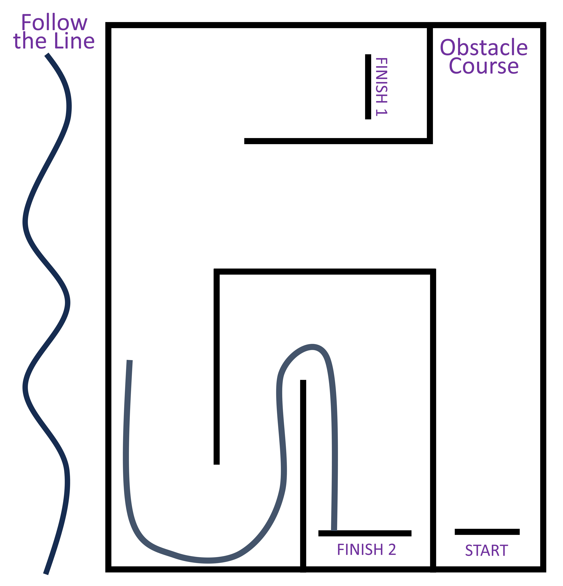

- [Submission Template](ObstacleCourse.pptx)

Your task is to program the robot to work its way through the obstacle course, from Start to Finish 1.

You know how to make the robot move forwards, and how to make it turn on the spot, so getting through the obstacle course should be a matter of working out the sequence of moves and turns, and working out how far you need to move and turn each time.

Use the [Submission Template](ObstacleCourse.pptx) to build your portfolio of evidence. You will need to include:
- a flowchart which lays out the sequence of steps the robot will go through to get through the course,
- the code you write which makes the robot do this,
- a video (taken with your laptop) of the robot successfully navigating the course.

Keep this file, as you'll use it again for the second and third parts of the Obstacle Course task before uploading it to SEQTA.

