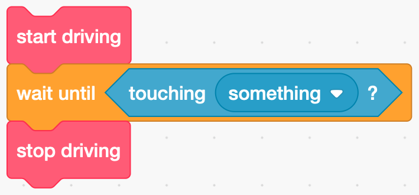

Having worked through the obstacle course, you'll notice how fussy and annoying the robot is. Start the robot slightly forward or back of your mark and it'll miss the turn. Get the starting angle slightly wrong and the robot can end up in the wrong place entirely. We can minimise this problem by introducing some **sensors**. Sensors are ways the computer can find out about the world around it. Our robot is equipped with four sensors:
- two color sensors (note the American spelling of colour here...), mounted on the front left and right facing the ground;
- a touch sensor, basically a big cross shaped button, in the middle; and
- and ultrasonic sensor, mounted just belor the touch sensor.

This table shows their names and which port they should be connected to:

Port|Name|Sensor
----|----|------
1|LCOLOR|Left color sensor
2|TOUCH|Touch sensor
3|USONIC|Ultrasonic sensor
4|RCOLOR|Right color sensor
{class="table table-striped"}

A typical thing you might want to do with a sensor is code snippet like this:



In most languages end up writing something more like this:

```ruby
start driving
loop
    if touching something then
        break
    end-if
end-loop
stop driving
```

For our robot, this becomes:
```python
robot.drive(100, 0)
while True:
    if robot.read(TOUCH):
        break
robot.stop()
```

Before we use the sensor, we need to add it to our setup command, so the full code would read:

```python {linenos=true, style=dracula}
robot.setup(DRIVE_BASE, TOUCH)

robot.drive(100, 0)
while True:
    if robot.read(TOUCH):
        break
robot.stop()
```
