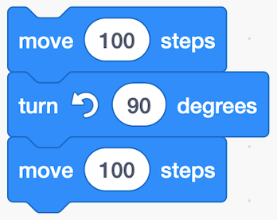

Computers are simple machines. They do not think. They mindlessly follow instructions, one after another, in the order they are given. This idea is called **sequence**, and is the foundation of programming. Our job is to determine the correct sequence of instructions to give the computer so that it does what we want it to do.

Many of you would have used Scratch, where you stick commands together.

This is a sequence. 